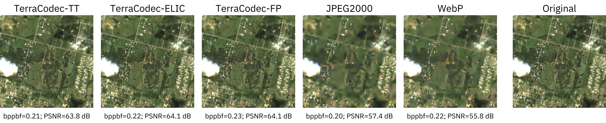
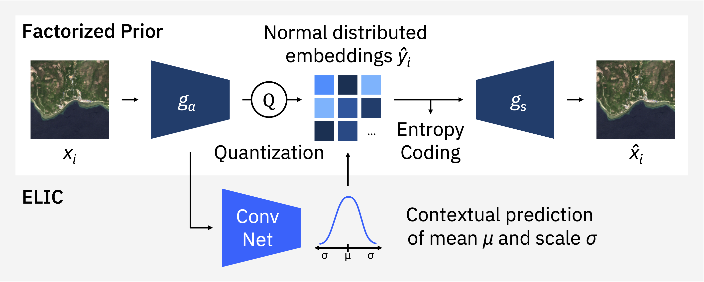
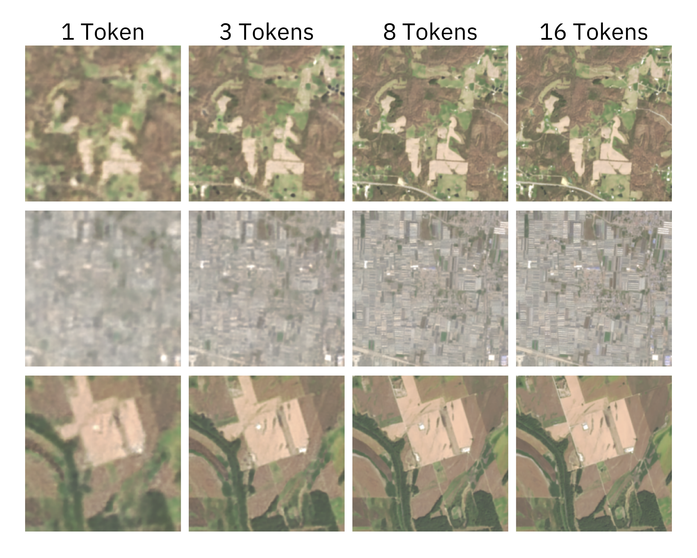

# TerraCodec
**Compressing Optical Earth Observation Data**

<div align="center">
  <a href="assets/reconstructions.png">
    
  </a>
</div>

TerraCodec (TEC) is a family of pretrained neural compression models for optical Sentinel-2 Earth Observation imagery. Models compress multispectral images and seasonal time series using learned latent representations and entropy coding.

Compared to classical codecs (JPEG2000, WebP, HEVC), TerraCodec achieves **3–10× higher compression** at comparable reconstruction quality on multispectral EO imagery. Temporal models further improve compression by exploiting redundancy across seasonal sequences.


📄 **Paper:** https://arxiv.org/abs/2510.12670  
🤗 **Models:** https://huggingface.co/embed2scale

---

## Installation

```bash
pip install terracodec
```

**Requirements:** Python ≥ 3.10, PyTorch ≥ 2.0

All pretrained checkpoints are automatically downloaded from HuggingFace on first use.

---

## Models

TerraCodec includes **image codecs** and **temporal codecs** for EO data.

### Image Codecs

| Model | Description |
|---|---|
| **TEC-FP** | Factorized-prior model. Smallest, strong baseline. |
| **TEC-ELIC** | Enhanced entropy model with spatial + channel context. Better rate–distortion, slightly larger. |

<details>
<summary><b>TEC Image Architecture</b></summary>

[](assets/TEC_image_architecture.png)

</details>

### Temporal Codecs

| Model | Description                                                                                                                 |
|---|-----------------------------------------------------------------------------------------------------------------------------|
| **TEC-TT** | Temporal Transformer for multispectral time series data. Predicts latent distributions from previous frames.                |
| **FlexTEC** | Flexible-rate extension of TEC-TT. One checkpoint covers many compression levels via latent repacking and token prediction. |

<details>
<summary><b>TEC-TT Architecture</b></summary>

[](assets/TEC_TT_architecture.png)

</details>

<details>
<summary><b>FlexTEC Examples</b></summary>

*One model, multiple quality levels: by varying the token budget at inference, FlexTEC provides different compression/quality trade-offs. Early tokens encode global structure; additional tokens progressively refine details.*

[](assets/TEC_Flex_examples.png)

</details>

---

## Pretrained Checkpoints

### Image Compression

| Checkpoint | Architecture | Training Data | λ values |
|---|---|---|---|
| `terracodec_v1_fp_s2l2a` | TEC-FP | Sentinel-2 L2A | 0.5, 2, 10, 40, 200 |
| `terracodec_v1_elic_s2l2a` | TEC-ELIC | Sentinel-2 L2A | 0.5, 2, 10, 40, 200 |

Low λ → higher compression. High λ → higher quality.

### Temporal Compression

| Checkpoint | Architecture | Training Data | λ values                     |
|---|---|---|------------------------------|
| `terracodec_v1_tt_s2l2a` | TEC-TT | Sentinel-2 L2A (seasonal) | 0.4, 1, 5, 20, 100, 200, 700 |
| `terracodec_v1_tt_s2l1c` | TEC-TT | Sentinel-2 L1C | 5, 20, 100                   |

The L1C model was used for the declouding experiments in the paper.

### Flexible-Rate

| Checkpoint | Architecture | Quality range |
|---|---|---|
| `flextec_v1_s2l2a` | FlexTEC | 1–16 (low = high compression) |

---

## Loading Models

### Standalone Usage

**Image codec** — pass `compression` as a λ value:
```python
from terracodec import terracodec_v1_fp_s2l2a

model = terracodec_v1_fp_s2l2a(
    pretrained=True,
    compression=10
)
```

**Temporal codec** — pass `compression` as a λ value:
```python
from terracodec import terracodec_v1_tt_s2l2a

model = terracodec_v1_tt_s2l2a(
    pretrained=True,
    compression=20
)
```

**FlexTEC** — one model for many compression levels, quality is specified at inference time (see below):
```python
from terracodec import flextec_v1_s2l2a

model = flextec_v1_s2l2a(
    pretrained=True,
)
```

### Alternative: TerraTorch Integration

TerraCodec models are also available through the
[TerraTorch](https://github.com/terrastackai/terratorch) model registry.

Install TerraTorch with the optional TerraCodec module. To ensure compatibility,
we recommend installing TerraTorch from the **main branch**:

```bash
pip install "terratorch[terracodec] @ git+https://github.com/terrastackai/terratorch@main"
```
Models can then be instantiated directly via the registry:
```python
from terratorch import FULL_MODEL_REGISTRY

model = FULL_MODEL_REGISTRY.build(
    "terracodec_v1_fp_s2l2a",
    pretrained=True,
    compression=10
)
```


---

## Input Format

### Tensor shapes

| Codec type | Shape | Example |
|---|---|---|
| Image codecs | `[B, C, H, W]` | `[1, 12, 256, 256]` |
| Temporal codecs | `[B, T, C, H, W]` | `[1, 4, 12, 256, 256]` |

- **12 spectral bands** (Sentinel-2 L2A) or 13 bands (L1C)
- **Spatial size:** 256×256 recommended. TEC-FP accepts arbitrary sizes; all other models expect 256×256.
- **Temporal models:** Models are pretrained on four seasonal frames but can process an arbitrary number of input timesteps at inference time. Using more frames increases the computational cost and therefore the required inference time.

### Normalization

All models are pretrained on Training used [SSL4EO-S12 v1.1](https://huggingface.co/datasets/embed2scale/SSL4EO-S12-v1.1).

Inputs should be standardized per spectral band using SSL4EO-S12 v1.1 L2A statistics:

```python
mean = torch.tensor([793.243, 924.863, 1184.553, 1340.936, 1671.402, 2240.082, 2468.412, 2563.243, 2627.704, 2711.071, 2416.714, 1849.625])
std = torch.tensor([1160.144, 1201.092, 1219.943, 1397.225, 1400.035, 1373.136, 1429.170, 1485.025, 1447.836, 1652.703, 1471.002, 1365.307])
```

For S2L1C, similarly use:
```python
mean = torch.tensor([1607.345, 1393.068, 1320.225, 1373.963, 1562.536, 2110.071, 2392.832, 2321.154, 2583.77,  838.712, 21.753, 2205.112, 1545.798])
std = torch.tensor([786.523, 849.702, 875.318, 1143.578, 1126.248, 1161.98, 1273.505, 1246.79, 1342.755, 576.795, 45.626, 1340.347, 1145.036])
```

---

## Inference

### Forward pass (fast, no bitstream)

```python
# Image codec
reconstruction = model(inputs)

# Temporal codec
reconstruction, _ = model(sequence)
```

### Compress / decompress (true bitstream)

```python
# Image or temporal codec
compressed = model.compress(inputs)
reconstruction = model.decompress(**compressed)

print(compressed["bits"])   # total bits
```

### FlexTEC

```python
# Quality 1–16: lower = higher compression
compressed = model.compress(sequence, quality=8)
reconstruction = model.decompress(compressed)
```

---

## Examples & Notebooks

The `notebooks/` directory contains end-to-end examples:

| Notebook | Description |
|---|---|
| `terracodec_fp_usage.ipynb` | TEC-FP image codec walkthrough |
| `terracodec_elic_usage.ipynb` | TEC-ELIC image codec walkthrough |
| `terracodec_tt_usage.ipynb` | TEC-TT temporal codec walkthrough |

Example Sentinel-2 images are in `examples/`.

---

## FAQ

**Reconstruction quality is poor**

1. **Check preprocessing** — verify band order, reflectance scaling, and per-band normalization.
2. **GPU nondeterminism** — entropy coding is sensitive to nondeterministic GPU operations. Enable deterministic mode:

```python
os.environ.setdefault("CUBLAS_WORKSPACE_CONFIG", ":16:8")
torch.backends.cudnn.benchmark = False
torch.use_deterministic_algorithms(True)
```

If CPU and GPU results differ, nondeterminism is likely the cause.

---

## Citation

```bibtex
@article{terracodec2025,
  title   = {TerraCodec: Neural Codecs for Earth Observation},
  author  = {Costa Watanabe, Julen and Wittmann, Isabelle and Blumenstiel, Benedikt},
  journal = {arXiv preprint arXiv:2510.12670},
  year    = {2025}
}
```

---

## License

Apache 2.0 — see [LICENSE](LICENSE).

---

## Acknowledgments

<div align="center">
  
</div>

This research is carried out as part of the Embed2Scale project and is co-funded
by the EU Horizon Europe program under Grant Agreement No. 101131841.
Additional funding for this project has been provided by the Swiss State Sec-
retariat for Education, Research and Innovation (SERI) and UK Research and
Innovation (UKRI).